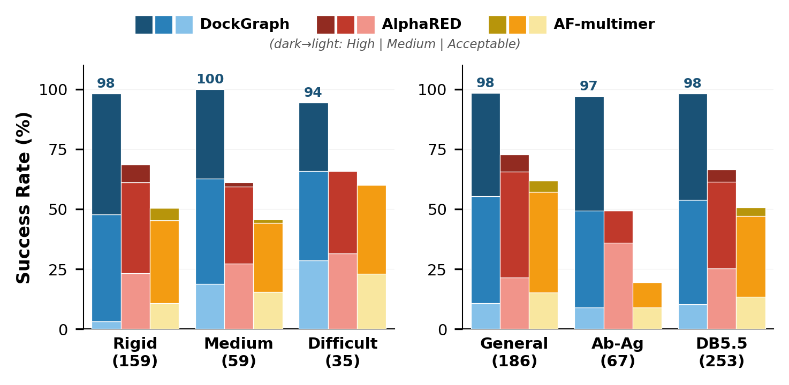

# DockGraph

A dual-encoder graph neural network for protein-protein docking refinement.

## Results

Evaluated on 253 targets from Docking Benchmark 5.5 using CAPRI metrics.



| Metric | DockGraph | AlphaRED | AF-multimer |
|--------|-----------|----------|-------------|
| Overall success (DockQ ≥ 0.23) | **98.0%** | 63.0% | 43.0% |
| Antibody-antigen success | **97.0%** | 43.0% | 20.0% |
| Mean DockQ | **0.728** | — | — |
| Mean I-RMSD | **1.28 Å** | — | — |

| Difficulty | Targets | Success Rate | Mean DockQ | Mean I-RMSD |
|------------|---------|-------------|------------|-------------|
| Rigid | 159 | 98.1% | 0.768 | 0.98 Å |
| Medium | 59 | 100.0% | 0.696 | 1.32 Å |
| Difficult | 35 | 94.3% | 0.602 | 2.58 Å |

## Data

Docking Benchmark 5.5 is included under `data/benchmark/`. Original source: [Graylab/AlphaRED](https://github.com/Graylab/AlphaRED/tree/main/benchmark).

## Installation
```bash
git clone https://github.com/Kazi-Nasif/DockGraph.git
cd DockGraph
pip install -r requirements.txt
```

Requires Python 3.10+ and a CUDA GPU (optional).

## Reproducing Results

All scripts are in the `scripts/` directory. Run them in order:

### Step 1: Examine the dataset
```bash
cd scripts
python step1_examine_data.py 1A2K rigid_targets
python step1_examine_data.py 5WHK medium_targets
python step1_examine_data.py 1ATN difficult_targets
```

### Step 2: Test data loader
```bash
python step2_data_loader.py
```

### Step 3: Verify feature extraction
```bash
python step3_feature_extraction.py 1A2K rigid_targets
python step3_feature_extraction.py 1ATN difficult_targets
```

### Step 4: Test model (untrained)
```bash
python step4_model.py 1A2K rigid_targets
```

### Step 5: Train
```bash
python step5_train.py
```

### Step 6: Evaluate (full CAPRI metrics)
```bash
python step6_evaluate.py
```

### Step 7: Evaluate on antibody-antigen targets
```bash
python eval_antibody.py
```

## Usage

### Predict docking
```bash
python predict.py data/benchmark/<difficulty>/<PDB_ID>/<PDB_ID>_r_u.pdb \
                  data/benchmark/<difficulty>/<PDB_ID>/<PDB_ID>_l_u.pdb
```

### Predict and evaluate against ground truth
```bash
python predict.py data/benchmark/<difficulty>/<PDB_ID>/<PDB_ID>_r_u.pdb \
                  data/benchmark/<difficulty>/<PDB_ID>/<PDB_ID>_l_u.pdb \
                  --bound data/benchmark/<difficulty>/<PDB_ID>/<PDB_ID>_b.pdb \
                  --lig_chains <chain_ids>
```

### Options

| Flag | Description |
|------|-------------|
| `--bound` | Bound complex PDB for evaluation |
| `--lig_chains` | Ligand chain IDs |
| `--rec_chains` | Receptor chain IDs |
| `-o` | Output PDB path |
| `--checkpoint` | Model file path |

### Example
```bash
python predict.py data/benchmark/rigid_targets/1A2K/1A2K_r_u.pdb \
                  data/benchmark/rigid_targets/1A2K/1A2K_l_u.pdb \
                  --bound data/benchmark/rigid_targets/1A2K/1A2K_b.pdb \
                  --lig_chains C
```
```
======================================================================
DockGraph — Protein-Protein Docking Prediction
======================================================================
  Receptor: 1A2K_r_u.pdb  chains=['A', 'B']
  Ligand:   1A2K_l_u.pdb  chains=['C']

  Confidence: 0.9897
  Displacement: 0.09 A

EVALUATION
  DockQ:   0.9792  (high)
  fnat:    1.0000
  I-RMSD:  0.3247 A
  L-RMSD:  1.1396 A
  Acceptable+: YES
```

Predicted complex is saved to `predicted_complex/predicted_complex.pdb`.

## License

MIT
